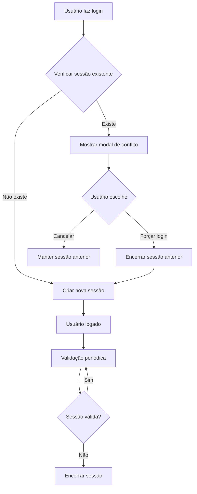

# 🔐 Sistema de Sessão Única - Guia de Implementação

## 📋 Visão Geral

Este sistema implementa **sessão única por usuário**, impedindo que o mesmo usuário faça login em múltiplos navegadores/dispositivos simultaneamente.

## 🎯 Funcionalidades

- ✅ **Uma sessão por usuário**: Apenas um login ativo por vez
- ✅ **Detecção de conflitos**: Alerta quando há tentativa de login duplicado
- ✅ **Kickout automático**: Encerra sessões anteriores automaticamente
- ✅ **Validação em tempo real**: Verifica sessão a cada 30 segundos
- ✅ **Informações do dispositivo**: Mostra onde está a sessão ativa
- ✅ **Expiração automática**: Sessões expiram em 7 dias

## 🚀 Como Implementar

### **1. Executar SQL no Supabase**

```sql
-- Execute o arquivo: create-single-session-system.sql
-- No Supabase SQL Editor
```

### **2. Integrar no App Principal**

```tsx
// src/app/layout.tsx ou src/pages/_app.tsx
import { SessionManager } from '@/components/SessionManager';

export default function RootLayout({ children }) {
  return (
    <html>
      <body>
        <SessionManager>
          {children}
        </SessionManager>
      </body>
    </html>
  );
}
```

### **3. Substituir useAuth**

```tsx
// Em vez de usar useAuth diretamente
import { useAuthWithSingleSession } from '@/hooks/useAuthWithSingleSession';

function LoginComponent() {
  const { signInWithSession, loading } = useAuthWithSingleSession();
  
  const handleLogin = async (email, password) => {
    const { data, error } = await signInWithSession(email, password);
    // ... resto da lógica
  };
}
```

### **4. Configurar Middleware (Opcional)**

```tsx
// src/mages/_middleware.ts
import { sessionMiddleware } from '@/middleware/sessionValidation';

export function middleware(request) {
  return sessionMiddleware(request);
}

export const config = {
  matcher: ['/dashboard/:path*', '/cursos/:path*', '/admin/:path*']
};
```

## 🔧 Configurações

### **Tempo de Verificação**
```tsx
// Verificar sessão a cada 30 segundos
const { createSession } = useSingleSession({
  checkInterval: 30000 // 30 segundos
});
```

### **Tempo de Expiração**
```sql
-- Sessões expiram em 7 dias (configurável)
expires_at TIMESTAMP WITH TIME ZONE DEFAULT (NOW() + INTERVAL '7 days')
```

### **Limpeza Automática**
```sql
-- Executar periodicamente para limpar sessões expiradas
SELECT cleanup_expired_sessions();
```

## 📱 Experiência do Usuário

### **Cenário 1: Login Normal**
1. Usuário faz login
2. Sistema cria sessão única
3. Usuário acessa a aplicação normalmente

### **Cenário 2: Tentativa de Login Duplicado**
1. Usuário tenta fazer login em outro dispositivo
2. Sistema detecta sessão ativa
3. Mostra modal com opções:
   - **Forçar Login**: Encerra sessão anterior
   - **Cancelar**: Mantém sessão anterior

### **Cenário 3: Sessão Expirada**
1. Sessão expira (7 dias ou inatividade)
2. Sistema detecta expiração
3. Redireciona para login automaticamente

## 🛡️ Segurança

### **Proteções Implementadas**
- ✅ **Tokens únicos**: Cada sessão tem token único
- ✅ **Validação contínua**: Verifica sessão periodicamente
- ✅ **Expiração automática**: Sessões não ficam ativas indefinidamente
- ✅ **Limpeza de dados**: Remove sessões expiradas automaticamente
- ✅ **RLS**: Row Level Security no Supabase

### **Informações Coletadas**
- **Device Info**: Navegador, sistema operacional, resolução
- **IP Address**: Endereço IP do usuário
- **User Agent**: Informações do navegador
- **Timestamps**: Criação e última atividade

## 📊 Monitoramento

### **Queries Úteis**

```sql
-- Ver sessões ativas
SELECT * FROM active_sessions 
WHERE expires_at > NOW();

-- Ver sessões por usuário
SELECT * FROM active_sessions 
WHERE user_id = 'user-uuid-here';

-- Limpar sessões expiradas
SELECT cleanup_expired_sessions();
```

### **Métricas Importantes**
- **Sessões ativas**: Quantos usuários estão logados
- **Conflitos detectados**: Tentativas de login duplicado
- **Sessões expiradas**: Limpeza automática funcionando
- **Tempo médio de sessão**: Duração das sessões

## 🔄 Fluxo de Funcionamento



## ⚠️ Considerações

### **Limitações**
- **Apenas uma sessão**: Usuário não pode estar logado em múltiplos lugares
- **Expiração fixa**: 7 dias (configurável)
- **Dependência do Supabase**: Requer conexão com banco

### **Alternativas**
- **Múltiplas sessões**: Permitir 2-3 sessões simultâneas
- **Sessões por dispositivo**: Uma sessão por tipo de dispositivo
- **Sessões por localização**: Baseado em IP/geolocalização

## 🎯 Benefícios

### **Para o Negócio**
- ✅ **Controle de acesso**: Evita compartilhamento de contas
- ✅ **Segurança**: Reduz riscos de sessões comprometidas
- ✅ **Compliance**: Atende requisitos de segurança
- ✅ **Auditoria**: Rastreamento de sessões

### **Para o Usuário**
- ✅ **Segurança**: Protege conta contra uso não autorizado
- ✅ **Transparência**: Sabe quando há sessões ativas
- ✅ **Controle**: Pode encerrar sessões remotamente
- ✅ **Notificações**: Alerta sobre atividades suspeitas

## 🚀 Próximos Passos

1. **Executar SQL** no Supabase
2. **Integrar componentes** na aplicação
3. **Testar cenários** de conflito
4. **Configurar monitoramento**
5. **Documentar para usuários**

**🎉 Sistema de Sessão Única implementado com sucesso!**


